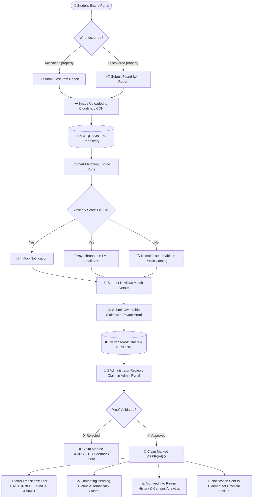
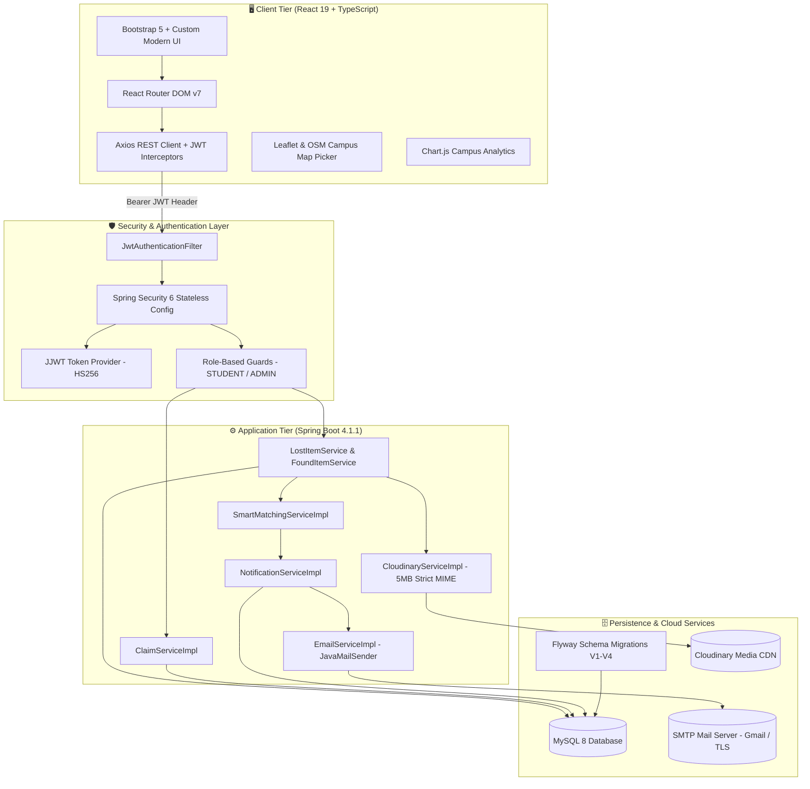
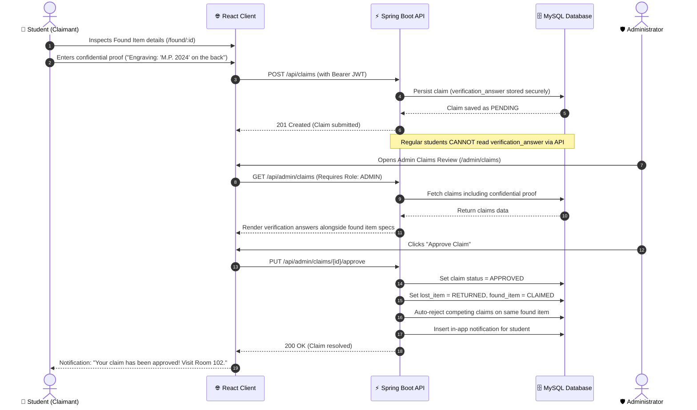
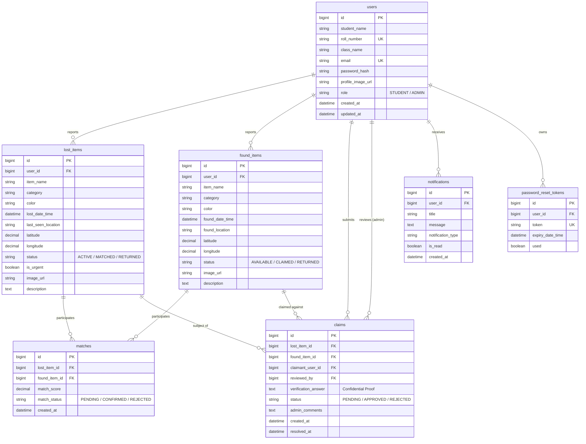

<div align="center">

# 🎓 College Lost & Found System

### *Find it. Report it. Return it.*

A secure, enterprise-grade, full-stack campus platform connecting students and administrators to report, discover, match, claim, and recover misplaced personal property.

<p align="center">
  
  
  
  
  
  
  
  
</p>

<p align="center">
  <a href="#-table-of-contents">Table of Contents</a> •
  <a href="#-system-overview">Overview</a> •
  <a href="#-architecture--workflows">Workflows</a> •
  <a href="#-smart-matching-engine">Matching Engine</a> •
  <a href="#-features">Features</a> •
  <a href="#-quick-start">Quick Start</a> •
  <a href="#-rest-api-reference">API Reference</a> •
  <a href="#-documentation-index">Documentation</a>
</p>

</div>

---

## 📑 Table of Contents

- [💡 System Overview](#-system-overview)
- [🏗️ System Architecture & Workflows](#️-system-architecture--workflows)
  - [1. End-to-End Recovery Flow](#1-end-to-end-recovery-flow)
  - [2. Multi-Tier Component Architecture](#2-multi-tier-component-architecture)
  - [3. Privacy-Preserving Claim Verification Sequence](#3-privacy-preserving-claim-verification-sequence)
- [🧠 Smart Matching Engine](#-smart-matching-engine)
- [🌟 Key Features](#-key-features)
  - [Student Features](#-student-features)
  - [Administrator Features](#-administrator-features)
  - [Platform & Infrastructure Features](#-platform--infrastructure-features)
- [🧰 Technology Stack](#-technology-stack)
- [📁 Project Structure](#-project-structure)
- [⚙️ Environment Configuration](#️-environment-configuration)
- [🚀 Quick Start & Installation](#-quick-start--installation)
  - [Prerequisites](#prerequisites)
  - [1. Database Setup](#1-database-setup)
  - [2. Environment Configuration](#2-environment-configuration)
  - [3. Start the Backend API](#3-start-the-backend-api)
  - [4. Start the Frontend Client](#4-start-the-frontend-client)
  - [Default Bootstrap Credentials](#default-bootstrap-credentials)
- [🔌 REST API Reference](#-rest-api-reference)
- [🗄️ Database Architecture & Migrations](#️-database-architecture--migrations)
- [🔒 Security & Privacy Highlights](#-security--privacy-highlights)
- [🧪 Testing & Quality Assurance](#-testing--quality-assurance)
- [🗺️ Application Route Directory](#️-application-route-directory)
- [📚 Documentation Index](#-documentation-index)
- [📄 License & Academic Note](#-license--academic-note)

---

## 💡 System Overview

Every academic semester, hundreds of personal items—student identification cards, laboratory notebooks, keys, wallets, water bottles, and expensive electronics—are misplaced across campus lecture halls, cafeterias, sports facilities, and transit areas.

Traditionally, universities rely on disorganized physical notice boards, unofficial WhatsApp/Telegram channels, and fragmented lost-and-found desks. These legacy channels suffer from:
- ❌ **Zero searchability** and poor categorization.
- ❌ **Privacy vulnerabilities**, broadcasting claimant information publicly.
- ❌ **Fraudulent claims**, as anyone can falsely claim items without verified ownership proof.
- ❌ **No automated alerting**, requiring owners to manually scour chat logs daily.

### The Solution: College Lost & Found System
This platform provides an automated, secure, and privacy-first solution designed specifically for campus ecosystems:
1. **Intelligent Automation:** When a found or lost item is reported, an algorithmic **Smart Matching Engine** computes multi-factor similarity across 5 criteria (category, color, location, date, and description).
2. **Dual-Channel Match Alerts:** Matches exceeding a 50% confidence threshold instantly trigger real-time **in-app notifications** and **asynchronous HTML email alerts**.
3. **Privacy-Preserving Claim Verification:** Students submit ownership claims backed by confidential verification answers (e.g., engravings, unique stickers, serial codes, wallpaper descriptions). These answers are **strictly hidden** from other users and only accessible to verified administrators.
4. **Administrative Audit & Recovery:** Administrators validate ownership proofs before transitioning items to `RETURNED` status, logging resolution metrics into an immutable history audit trail.

---

## 🏗️ System Architecture & Workflows

### 1. End-to-End Recovery Flow



---

### 2. Multi-Tier Component Architecture



---

### 3. Privacy-Preserving Claim Verification Sequence



---

## 🧠 Smart Matching Engine

The core innovation of the platform is its deterministic, multi-factor **Smart Matching Algorithm** implemented in [`SmartMatchingServiceImpl.java`](backend/src/main/java/com/collegelostandfound/backend/service/SmartMatchingServiceImpl.java). Whenever an item is reported or updated, it is evaluated synchronously against all opposite-status items.

The similarity score is computed on a **100-point scale**:

$$\text{Total Score} = S_{\text{category}} + S_{\text{color}} + S_{\text{location}} + S_{\text{date}} + S_{\text{description}}$$

### Scoring Breakdown

| Dimension | Max Points | Evaluation Logic | Example |
| :--- | :---: | :--- | :--- |
| **Category** | **30** | Exact match (case-insensitive) = **+30**; otherwise = **0**. | `Electronics` == `Electronics` (+30) |
| **Color** | **20** | Exact match = **+20**<br>Substring containment = **+15**<br>No match = **0** | `Dark Blue` contains `Blue` (+15) |
| **Location** | **20** | Exact string match = **+20**<br>Substring match = **+15**<br>Tokenized keyword overlap = **+10** | `Central Library 2nd Floor` contains `Central Library` (+15) |
| **Date Proximity** | **10** | Same calendar day ($\Delta d = 0$) = **+10**<br>Within 3 days ($\Delta d \le 3$) = **+8**<br>Within 7 days ($\Delta d \le 7$) = **+5**<br>Within 14 days ($\Delta d \le 14$) = **+2**<br>Greater than 14 days = **0** | Lost Oct 3, Found Oct 4 ($\Delta d = 1$) (+8) |
| **Description** | **20** | Normalized tokenized word overlap (Jaccard similarity index on non-trivial tokens) scaled to **20** points. | Shared keywords: `laptop`, `dell`, `silver`, `backpack` |

### Action Thresholds

```
 0% ────────────────── 24% ────────────────── 49% ────────────────── 100%
 │   Discarded / Weak   │   Saved as Match   │   High Confidence Match  │
 │   No DB Record       │   Stored in DB     │   In-App + Email Alert   │
```

- **Score $\ge$ 25.0%:** Automatically recorded in the `matches` database table with status `PENDING`.
- **Score $\ge$ 50.0%:** Deemed a high-confidence match. The system immediately creates an in-app notification row and dispatches an asynchronous HTML email alert containing direct match inspection links to the owner.

---

## 🌟 Key Features

### 👤 Student Features
- 🔐 **Authentication & Registration:** Sign up with Student Name, Roll Number, Class, Email, and Password. Secure BCrypt hashing with 10 salt rounds.
- 🔑 **Self-Service Password Recovery:** Time-bounded (30-minute) cryptographic password reset tokens delivered via automated email.
- 📍 **Campus Geolocation Picker:** Interactive Leaflet / OpenStreetMap integration to pinpoint exact latitude and longitude coordinates where an item was last seen or found.
- 🚨 **Urgency Flags:** Students can flag lost critical items (e.g., passports, hall tickets, essential medication) as **Urgent**, rendering high-visibility badges across search and catalog feeds.
- 📸 **Cloudinary Media Upload:** Seamless photo uploads with client-side preview, automatic backend MIME verification (JPEG, PNG, WEBP), and 5MB size enforcement.
- 🔎 **Multi-Faceted Search Engine:** Filter campus reports simultaneously by keyword, category, campus zone, color, date range, status, and urgency.
- 🎯 **Smart Match Dashboard:** Inspect potential algorithmic matches with clear score breakdowns and side-by-side comparison cards.
- 🛡️ **Anti-Fraud Claim Submission:** Submit ownership claims with confidential proof details invisible to fellow students.
- 🔔 **Real-Time Notification Bell:** In-app badge count and instant alerts for match notifications, claim reviews, and admin approvals.
- 👤 **Profile Customization:** Update personal class information, profile pictures, and passwords.

### 🛡️ Administrator Features
- 📊 **Executive Analytics Dashboard:** Real-time KPI summary displaying Total Lost Items, Total Found Items, Active Pending Claims, Resolved Items, and Campus Recovery Rate %.
- ⚖️ **Claim Verification Portal:** Comprehensive review interface allowing administrators to compare claimant proofs against private item specifications and approve or reject claims with custom feedback.
- 🔄 **Atomic Resolution Cascade:** Approving a claim automatically updates the lost item to `RETURNED`, found item to `CLAIMED`, marks competing pending claims as `REJECTED`, and dispatches notification alerts.
- 📜 **Immutable Return History:** Detailed audit log tracking resolved items, return timestamps, claimant identities, and verifying administrators.
- 🧹 **Campus Item Governance:** Full administrative capability to moderate, edit, or delete spam, offensive, or duplicate entries.
- ⚙️ **Dynamic Campus Configuration:** Manage supported campus zones and item categories directly from the administration settings panel.

### ⚙️ Platform & Infrastructure Features
- **Stateless JWT Security:** High-performance Bearer token authentication with 24-hour validity and complete role-based endpoint isolation (`hasRole('ADMIN')`).
- **Flyway Database Migrations:** Version-controlled database schema management (`V1` through `V4`) ensuring repeatable and zero-drift deployments.
- **Asynchronous Email Subsystem:** Spring `@Async` email delivery via SMTP with formatted HTML templates for password resets and high-priority match notifications.
- **RESTful API Contract:** Clean JSON DTO separation protecting internal entities and sensitive credentials.

---

## 🧰 Technology Stack

| Layer | Technology | Version | Purpose |
| :--- | :--- | :--- | :--- |
| **Frontend Framework** | **React** | `19.2.8` | Component-based, responsive user interface |
| **Language (Frontend)** | **TypeScript** | `6.0.2` | Compile-time type safety and interface validation |
| **Build Tool & Bundler** | **Vite** | `8.2.0` | Ultra-fast Hot Module Replacement and production bundling |
| **Routing** | **React Router DOM** | `7.18.2` | Client-side routing with protected and role-based guards |
| **UI Framework & Icons** | **Bootstrap & Icons** | `5.3.8` / `1.13.1` | Modern responsive grid, modals, and design tokens |
| **Campus Mapping** | **Leaflet** | `1.9.4` | Interactive campus coordinate picker and pinpoints |
| **Data Visualization** | **Chart.js** | `4.5.1` | Administrative dashboard metrics and recovery trends |
| **HTTP Client** | **Axios** | `1.19.0` | REST communication with JWT interceptors |
| **Backend Framework** | **Spring Boot** | `4.1.1` | Enterprise REST API, dependency injection, validation |
| **Language (Backend)** | **Java** | `JDK 21` (LTS) | Modern Java with records, pattern matching, and virtual threads |
| **Security & Auth** | **Spring Security + JJWT** | `0.12.6` | Stateless JWT Bearer token authentication & BCrypt hashing |
| **Database & ORM** | **MySQL 8.0 + Spring Data JPA** | Hibernate 6 | Relational storage, derived queries, and transaction bounds |
| **Schema Migration** | **Flyway** | Latest | Version-controlled schema migrations (`V1__` to `V4__`) |
| **Cloud Image Storage** | **Cloudinary SDK** | `1.39.0` | Secure multipart photo upload to cloud CDN (max 5MB) |
| **Email Service** | **Spring Mail / JavaMailSender** | Jakarta Mail | Asynchronous HTML emails via SMTP |

---

## 📁 Project Structure

```text
College-lost-and-found/
├── .env.example                       # Environment variables configuration template
├── README.md                          # Project documentation and quick start guide
├── DESIGN.md                          # Visual design system and styling tokens reference
├── backend/                           # Spring Boot REST API (Java 21)
│   ├── pom.xml                        # Maven dependencies & build configuration
│   ├── mvnw.cmd / mvnw                # Maven wrapper executables
│   └── src/
│       ├── main/
│       │   ├── java/com/collegelostandfound/backend/
│       │   │   ├── config/            # SecurityConfig, CorsConfig, CloudinaryConfig, Dotenv
│       │   │   ├── controller/        # Auth, User, LostItem, FoundItem, Claim, Match, Admin
│       │   │   ├── dto/               # Request and Response Data Transfer Objects
│       │   │   ├── entity/            # JPA Entities: User, LostItem, FoundItem, Claim, Match
│       │   │   ├── exception/         # GlobalExceptionHandler & custom exception classes
│       │   │   ├── repository/        # Spring Data JPA Repositories
│       │   │   ├── security/          # JwtService, JwtFilter, CustomUserDetailsService
│       │   │   └── service/           # Business logic & SmartMatchingServiceImpl
│       │   └── resources/
│       │       ├── application.properties
│       │       └── db/migration/      # Flyway SQL migrations (V1__ to V4__)
│       └── test/                      # Integration and security test suites
├── frontend/                          # React 19 + TypeScript + Vite Client
│   ├── package.json                   # Dependencies, scripts, and build metadata
│   ├── vite.config.ts                 # Vite bundler configuration
│   ├── index.html                     # HTML5 single-page application entry point
│   └── src/
│       ├── assets/                    # Static brand logos and vector illustrations
│       ├── components/                # Modular reusable UI cards, maps, navbar, footers
│       ├── context/                   # AuthContext, NotificationContext, ThemeContext
│       ├── layouts/                   # MainLayout, AdminLayout, AuthLayout
│       ├── pages/                     # Routed views: Lost, Found, Claims, Admin, Profile
│       ├── services/                  # Axios API wrappers (api.ts, authService.ts, etc.)
│       ├── styles/                    # Component-specific CSS and responsive layouts
│       ├── types/                     # TypeScript domain models and API contract types
│       └── utils/                     # Formatting helpers, date utilities, coordinate helpers
└── docs/                              # Detailed project specifications & viva guides
    ├── API_CONTRACT.md                # Full REST API specification with sample payloads
    ├── COMPLETE_PROJECT_GUIDE.md      # Comprehensive technical architecture & viva Q&A
    ├── DATABASE_SCHEMA.md             # Complete entity definitions, indexes, & ER diagram
    ├── PROJECT_SPEC.md                # Functional requirements & project specifications
    ├── SECURITY_AUDIT.md              # Security analysis and risk mitigation checklist
    ├── SECURITY_CHANGE_AUDIT.md       # Audit trail of security hardening changes
    ├── TEAM_RULES.md                  # Development conventions and branch management rules
    └── TESTING_CHECKLIST.md           # End-to-end verification and testing test cases
```

---

## ⚙️ Environment Configuration

The application requires environment configuration for database access, JWT security, email delivery, and Cloudinary media storage.

Copy `.env.example` in the project root to create your local `.env`:

```powershell
# Windows PowerShell
Copy-Item .env.example .env

# Linux / macOS
cp .env.example .env
```

### Environment Variables Reference Table

| Variable | Required | Default / Example | Purpose |
| :--- | :---: | :--- | :--- |
| `DB_USERNAME` | **Yes** | `root` | MySQL database username |
| `DB_PASSWORD` | **Yes** | `your_mysql_password` | MySQL database password |
| `JWT_SECRET` | **Yes** | *(32+ character random string)* | Cryptographic key used to sign and verify JWT Bearer tokens |
| `JWT_EXPIRATION_MS` | No | `86400000` (24 hours) | Token validity lifespan in milliseconds |
| `ADMIN_EMAIL` | **Yes** | `admin@college.edu` | Email for initial administrator bootstrap account |
| `ADMIN_PASSWORD` | **Yes** | `AdminSecurePass123!` | Password for bootstrap administrator account |
| `MAIL_HOST` | Optional | `smtp.gmail.com` | SMTP host for outgoing notification emails |
| `MAIL_PORT` | Optional | `587` | SMTP port (typically 587 for TLS) |
| `MAIL_USERNAME` | Optional | `campus.lostfound@gmail.com` | SMTP sender email address |
| `MAIL_PASSWORD` | Optional | `xxxx xxxx xxxx xxxx` | Dedicated SMTP App Password (do not use real account password) |
| `CLOUDINARY_CLOUD_NAME` | Optional | `your_cloud_name` | Cloudinary cloud account name |
| `CLOUDINARY_API_KEY` | Optional | `your_api_key` | Cloudinary API access key |
| `CLOUDINARY_API_SECRET` | Optional | `your_api_secret` | Cloudinary API private secret |
| `APP_FRONTEND_URL` | Optional | `http://localhost:5173` | Client URL used when generating password reset links |

> [!IMPORTANT]
> Never commit `.env` to version control. The repository's [`.gitignore`](.gitignore) is pre-configured to exclude all environment secret files.

---

## 🚀 Quick Start & Installation

### Prerequisites
Make sure the following tools are installed and available on your system path:
- ☕ **Java Development Kit (JDK) 21** or higher: `java -version`
- 🟢 **Node.js 18+ & npm**: `node -v` and `npm -v`
- 🐬 **MySQL Server 8.0**: Ensure the MySQL service is running locally on port `3306`
- 🌐 *(Optional)* Free [Cloudinary](https://cloudinary.com) account for live image uploads
- 📧 *(Optional)* Gmail account with an App Password for live SMTP email dispatch

---

### 1. Database Setup
Log in to your local MySQL instance and create the application database:

```sql
CREATE DATABASE lost_and_found CHARACTER SET utf8mb4 COLLATE utf8mb4_unicode_ci;
```

*(Note: Table creation is completely automated! Flyway will execute all migrations when the backend starts up.)*

---

### 2. Environment Configuration
Create your `.env` file at the root of the project and populate your local credentials:

```powershell
Copy-Item .env.example .env
```

Open `.env` in your editor and update `DB_USERNAME`, `DB_PASSWORD`, and `JWT_SECRET`.

---

### 3. Start the Backend API

Navigate into the `backend/` directory and launch the Spring Boot service using the included Maven wrapper:

```powershell
# Windows PowerShell
cd backend
.\mvnw.cmd spring-boot:run

# Linux / macOS
cd backend
./mvnw spring-boot:run
```

- 🚀 The backend will initialize Flyway migrations (`V1` through `V4`).
- 🛡️ The bootstrap administrator account defined in `.env` will be provisioned automatically.
- 📡 API Base URL: **`http://localhost:8080/api`**

---

### 4. Start the Frontend Client

Open a **separate terminal window**, navigate into `frontend/`, install dependencies, and launch the Vite development server:

```powershell
cd frontend
npm install
npm run dev
```

- 🌐 The development server will run at: **`http://localhost:5173`**
- Open your browser and navigate to `http://localhost:5173` to interact with the platform.

---

### Default Bootstrap Credentials

When the backend starts for the first time, it initializes an administrator account using the values configured in your `.env`:

| Parameter | Default Value | Notes |
| :--- | :--- | :--- |
| **Role** | `ADMIN` | Full access to `/admin` dashboard and review queues |
| **Email** | `admin@college.edu` *(from `ADMIN_EMAIL`)* | Administrative login username |
| **Password** | *(from `ADMIN_PASSWORD`)* | Defined in your `.env` configuration |

> [!TIP]
> To test student workflows, simply visit [`/register`](http://localhost:5173/register) and create a student account with your roll number and campus email.

---

## 🔌 REST API Reference

All protected endpoints require an `Authorization: Bearer <JWT_TOKEN>` header.

### Authentication & Account (`/api/auth`)
| Method | Endpoint | Access | Description |
| :---: | :--- | :---: | :--- |
| `POST` | `/api/auth/register` | Public | Register a new student account |
| `POST` | `/api/auth/login` | Public | Authenticate user and receive signed JWT |
| `POST` | `/api/auth/forgot-password` | Public | Generate reset token and send email link |
| `POST` | `/api/auth/reset-password` | Public | Reset password using valid cryptographic token |

### User Profile (`/api/users`)
| Method | Endpoint | Access | Description |
| :---: | :--- | :---: | :--- |
| `GET` | `/api/users/me` | Authenticated | Fetch current user's profile information |
| `PUT` | `/api/users/me` | Authenticated | Update user profile data & avatar URL |
| `POST` | `/api/users/me/change-password` | Authenticated | Change password with current password verification |

### Lost Items (`/api/lost-items`)
| Method | Endpoint | Access | Description |
| :---: | :--- | :---: | :--- |
| `GET` | `/api/lost-items` | Authenticated | Browse paginated active lost items |
| `GET` | `/api/lost-items/my` | Authenticated | Retrieve items reported by the logged-in student |
| `GET` | `/api/lost-items/{id}` | Authenticated | Retrieve complete lost item details |
| `POST` | `/api/lost-items` | Authenticated | Submit new lost item (triggers smart matching) |
| `PUT` | `/api/lost-items/{id}` | Owner / Admin | Update report details (re-computes matches) |
| `DELETE` | `/api/lost-items/{id}` | Owner / Admin | Delete personal lost item report |
| `POST` | `/api/lost-items/upload-image` | Authenticated | Upload multipart image to Cloudinary (max 5MB) |

### Found Items (`/api/found-items`)
| Method | Endpoint | Access | Description |
| :---: | :--- | :---: | :--- |
| `GET` | `/api/found-items` | Authenticated | Browse active found items available for claim |
| `GET` | `/api/found-items/my` | Authenticated | Retrieve found items submitted by current student |
| `GET` | `/api/found-items/{id}` | Authenticated | Retrieve found item details |
| `POST` | `/api/found-items` | Authenticated | Submit new found item (triggers smart matching) |
| `PUT` | `/api/found-items/{id}` | Owner / Admin | Update found item report |
| `DELETE` | `/api/found-items/{id}` | Owner / Admin | Delete found item report |

### Smart Matches (`/api/matches`)
| Method | Endpoint | Access | Description |
| :---: | :--- | :---: | :--- |
| `GET` | `/api/matches/lost/{lostItemId}` | Authenticated | View algorithmic matches for a specific lost item |
| `GET` | `/api/matches/found/{foundItemId}` | Authenticated | View algorithmic matches for a specific found item |
| `GET` | `/api/matches/{id}` | Authenticated | Inspect specific match score and breakdown |

### Claims (`/api/claims`)
| Method | Endpoint | Access | Description |
| :---: | :--- | :---: | :--- |
| `POST` | `/api/claims` | Authenticated | Submit ownership claim with confidential proof |
| `GET` | `/api/claims/my` | Authenticated | View history and review status of personal claims |
| `GET` | `/api/claims/{id}` | Owner / Admin | View claim record (proof hidden from other students) |

### Notifications & Search (`/api/notifications` & `/api/search`)
| Method | Endpoint | Access | Description |
| :---: | :--- | :---: | :--- |
| `GET` | `/api/notifications` | Authenticated | Retrieve list of in-app notifications |
| `GET` | `/api/notifications/unread` | Authenticated | Get count of unread notifications |
| `PUT` | `/api/notifications/{id}/read` | Authenticated | Mark a notification as read |
| `GET` | `/api/search` | Authenticated | Search across items by query, category, zone, color, date |

### Administrator Control (`/api/admin`)
| Method | Endpoint | Access | Description |
| :---: | :--- | :---: | :--- |
| `GET` | `/api/admin/dashboard` | Admin Only | Get system KPIs: recovery rate, counts, active claims |
| `GET` | `/api/admin/claims` | Admin Only | Inspect pending claims with hidden verification answers |
| `PUT` | `/api/admin/claims/{id}/approve` | Admin Only | Approve claim, mark item returned, auto-reject competitors |
| `PUT` | `/api/admin/claims/{id}/reject` | Admin Only | Reject claim with administrative reason |
| `GET` | `/api/admin/return-history` | Admin Only | Query immutable audit log of recovered campus property |
| `DELETE`| `/api/admin/lost-items/{id}` | Admin Only | Remove any lost item report campus-wide |
| `DELETE`| `/api/admin/found-items/{id}` | Admin Only | Remove any found item report campus-wide |

---

## 🗄️ Database Architecture & Migrations

The database is built on **MySQL 8** and maintained with **Flyway** version-controlled migration scripts located in [`backend/src/main/resources/db/migration/`](backend/src/main/resources/db/migration/).

```
V1__create_initial_schema.sql                (Creates users, lost_items, found_items, matches, claims, notifications + 15 indexes)
V2__add_item_coordinates.sql                 (Adds latitude and longitude DECIMAL(10,7) to lost and found items)
V3__add_match_and_claim_unique_constraints.sql (Enforces duplicate prevention on matches & claims)
V4__create_password_reset_token_table.sql    (Creates password_reset_tokens table with 30-min expiration)
```

### Entity-Relationship Diagram



---

## 🔒 Security & Privacy Highlights

The system has undergone thorough security hardening to prevent vulnerabilities and preserve student privacy:

1. **Confidential Claim Proof Protection:**
   - When a student submits a claim, their `verification_answer` (e.g., engravings, private marks, lock codes) is persisted with strict authorization boundaries.
   - Student DTOs and public search endpoints completely redact verification details. Only authorized users with the `ADMIN` authority can view this data during claim evaluation.
2. **Stateless JWT Architecture:**
   - Cryptographically signed using JJWT (HMAC-SHA256).
   - Validated on every incoming request by `JwtAuthenticationFilter` before reaching Spring controllers.
   - Client stores token in secure browser storage; Axios interceptors attach tokens automatically and manage `401 Unauthorized` token expiry redirections.
3. **Password Security:**
   - Passwords are encrypted using **BCrypt** with 10 salt rounds.
   - Plaintext passwords and `password_hash` strings are strictly excluded from all response DTOs.
4. **Cloudinary Upload Hardening:**
   - Image uploads pass directly through the backend server, ensuring that Cloudinary API credentials and write signatures never leak to the browser.
   - Server-side validation restricts uploads strictly to `image/jpeg`, `image/png`, and `image/webp` with a strict **5MB** size ceiling.
5. **Ownership & Access Verification:**
   - Students can only edit or delete items that they personally reported.
   - Administrator routes are guarded on both sides: on the frontend via `<AdminRouteGuard />` and on the backend via Spring Security `@PreAuthorize("hasRole('ADMIN')")`.

---

## 🧪 Testing & Quality Assurance

The codebase includes comprehensive automated integration test suites validating security, workflows, algorithms, and controllers:

```powershell
# Run backend tests
cd backend
.\mvnw.cmd test

# Run frontend linting & production build validation
cd frontend
npm run lint
npm run build
```

### Key Integration Test Suites in `backend/src/test/`:
- **`SecurityAuditTests.java`**: Exhaustive security verification testing role-based access control, token tampering, endpoint protections, and data isolation.
- **`SmartMatchingIntegrationTests.java`**: Verifies score calculation accuracy across categories, colors, locations, dates, and tokenized descriptions.
- **`ClaimIntegrationTests.java`**: Tests claim submission, proof privacy enforcement, administrator approval cascading, and competing claim auto-rejection.
- **`LostItemFlowIntegrationTests.java` & `FoundItemIntegrationTests.java`**: Validates full CRUD lifecycles, ownership validations, and catalog filtering.
- **`AuthFlowIntegrationTests.java` & `PasswordResetIntegrationTests.java`**: Tests user registration, BCrypt authentication, JWT generation, and tokenized password reset lifecycles.
- **`LostItemImageUploadIntegrationTests.java`**: Verifies 5MB file restrictions and MIME type whitelist validations.

---

## 🗺️ Application Route Directory

### 🌍 Public Routes
- `/` — Landing page with hero banner, feature highlights, and campus metrics.
- `/about` — System mission, campus guidelines, and architectural overview.
- `/login` — Secure student and administrator login portal.
- `/register` — New student onboarding and registration form.
- `/reset-password` — Password reset request and cryptographic token redemption.

### 🎓 Student Portal (Protected via JWT)
- `/dashboard` — Personal summary showing recent activity, active reports, matches, and claims.
- `/lost` — Public searchable directory of active lost items.
- `/found` — Public directory of active found items with claim triggers.
- `/report` or `/report/lost` — Interactive lost item reporting form with Leaflet map and photo upload.
- `/report/found` — Found item reporting form with campus location tagging.
- `/lost/:id` & `/found/:id` — Detailed item view with photo modal, timestamps, and status badges.
- `/my-lost` & `/my-found` — Manage personal item reports (edit, update, or delete).
- `/matches/lost/:lostItemId` — View algorithmic smart matches for a specific lost item.
- `/claims` — View history and review status of personal claims.
- `/notifications` — Notification feed displaying match alerts and claim resolution updates.
- `/search` — Multi-attribute search page with filters for category, color, zone, and urgency.
- `/profile` — Student profile settings, avatar upload, and password update.

### 🛡️ Administrator Portal (Role: ADMIN)
- `/admin` or `/admin/dashboard` — Executive command center with KPI cards, recovery rate chart, and metrics.
- `/admin/claims` — Claim verification interface to review confidential claimant proofs and execute approvals or rejections.
- `/admin/lost-items` & `/admin/found-items` — Full campus report catalog management and moderation.
- `/admin/return-history` — Permanent audit log and resolution timelines for all recovered campus belongings.
- `/admin/configuration` — Campus zones and category taxonomy configuration settings.

---

## 📚 Documentation Index

For in-depth architectural specifications, viva preparation questions, and testing guidelines, explore the [`docs/`](docs/) directory:

- 📖 [**Complete Project Guide & Viva Manual**](docs/COMPLETE_PROJECT_GUIDE.md): Master technical guide containing full feature traceability, architecture diagrams, and a 70+ Viva Question & Answer Bank.
- 🔌 [**REST API Contract**](docs/API_CONTRACT.md): Detailed specification of all request payloads, response schemas, and HTTP status codes.
- 🗄️ [**Database Schema Documentation**](docs/DATABASE_SCHEMA.md): Complete table definitions, relational constraints, foreign keys, and indexing strategy.
- 📋 [**Project Functional Specification**](docs/PROJECT_SPEC.md): Original requirements, stakeholder roles, and core project specifications.
- 🛡️ [**Security Audit**](docs/SECURITY_AUDIT.md) & [**Security Change Audit**](docs/SECURITY_CHANGE_AUDIT.md): Detailed security audit logs and hardening verification steps.
- 🧪 [**Testing Checklist**](docs/TESTING_CHECKLIST.md): Step-by-step test cases for manual QA and automated integration tests.
- 🤝 [**Team Development Rules**](docs/TEAM_RULES.md): Branching conventions, code review criteria, and git workflow rules.

---

## 📄 License & Academic Note

Developed as a college academic project. Built to demonstrate full-stack software engineering excellence, secure RESTful architecture, and automated algorithmic matching.

<div align="center">
  <sub>College Lost & Found System • Built with Spring Boot, React, TypeScript, and MySQL</sub>
</div>
